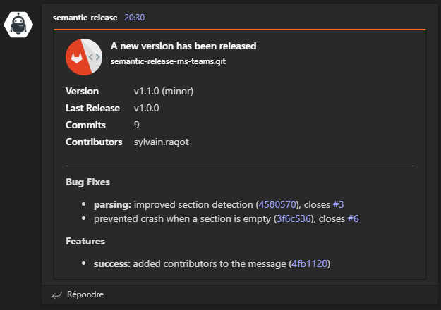

# semantic-release-ms-teams

[semantic-release](https://github.com/semantic-release/semantic-release) plugin to send release notes to a teams channel when the release succeeds.

| Step               | Description                                                    |
| ------------------ |----------------------------------------------------------------|
| `verifyConditions` | Check the `webhookUrl` option or `TEAMS_WEBHOOK_URL` variable. |
| `generateNotes`    | Allow sending release note to MS Teams in dry-run mode.        |
| `success`          | Send a Teams message to notify of a new release.               |

## Installation

```sh
npm install semantic-release-ms-teams --save-dev
# or
yarn add semantic-release-ms-teams --dev
```

This plugin is using an _incoming webhook_ to notify a teams channel. Here is
[some documentation](https://docs.microsoft.com/en-us/microsoftteams/platform/webhooks-and-connectors/how-to/add-incoming-webhook#add-an-incoming-webhook-to-a-teams-channel) to create one.

## Usage

```json
// .releaserc.json
{
  "branches": ["main"],
  "plugins": [
    "@semantic-release/commit-analyzer",
    "@semantic-release/release-notes-generator",
    ["semantic-release-ms-teams", {
      "webhookUrl": "...",
      "title": "A new version has been released",
      "imageUrl": "http://...",
      "showContributors": false,
      "notifyInDryRun": true,
    }]
  ]
}
```

| Variable                            | Details             | Description                                                                                                        | 
|-------------------------------------|---------------------|--------------------------------------------------------------------------------------------------------------------|
| `webhookUrl` or `TEAMS_WEBHOOK_URL` | **required**, url   | The incoming webhook url of the channel to publish release notes to.                                               |
| `title`                             | _optional_, text    | The title of the message. Default: _A new version has been released_                                               |
| `imageUrl`                          | _optional_, url     | An image displayed in the message, next to the title. The image must be less than 200x200.                         |
| `showContributors`                  | _optional_, boolean | Whether or not the contributors should be displayed in the message. Default: `true`                                |
| `notifyInDryRun`                    | _optional_, boolean | Whether or not the release notes will be send to Teams when semantic-release runs in dry-run mode. Default: `true` |

### Notes
- `webhookUrl` is a property of the config object in `.releaserc.json`, and,
  `TEAMS_WEBHOOK_URL` is an environment variable. The config object can be
  useful to try the plugin, but most of the time, production environments
  prefers environment variables. You can use both, but not in the same time as
  it does not make sense. If you do define both, the config object overrides
  the environment variable.
- 
- **IMPORTANT**: The `webhookUrl` variable you can use within your plugin
  configuration is meant to be used only for test purposes. Because you don't
  want to publicly publish this url and do let the world know a way to send
  messages to your teams channel, you will want to use the `TEAMS_WEBHOOK_URL`
  instead.

- The default value for `imageUrl` is 
  _https://upload.wikimedia.org/wikipedia/commons/thumb/4/4e/Gitlab_meaningful_logo.svg/144px-Gitlab_meaningful_logo.svg.png_

- The list of Contributors is built using the email associated with the commits
  (only the part before the "@" is kept). This list can be disable (mainly for
  privacy reasons).

- The official `@semantic-release/git` plugin may cause a second message to be
  sent (because the plugin potentially adds a commit on the current branch, to
  save changes in files like `package.json`, `package-lock.json`, `CHANGELOG.md`).
  In order to prevent that, an environment variable (`HAS_PREVIOUS_SEM_REL_EXECUTION`)
  is set to `true` after the first message, then this plugin won't send any other
  message, as long as the plugin is part of the config.

## Screenshots




## Development

Here are some steps to test the plugin locally:

- checkout the source code:
  ```sh
  git clone git@gitlab-ncsa.ubisoft.org:sragot/semantic-release-ms-teams.git
  cd semantic-release-ms-teams
  npm install
  ```
- create a personal access token in github, then `export GH_TOKEN=...`
- run `semantic-release` locally safely:
  ```sh
  npm link
  npm link semantic-release-ms-teams
  npm run release -- --dry-run --no-ci
  ```

## Dependencies

- [`remark`](https://www.npmjs.com/package/remark): Markdown to JSON
- [`mdast-util-to-markdown`](https://www.npmjs.com/package/mdast-util-to-markdown): JSON to Markdown

Greatly inspired by [semantic-release-slack-bot](https://github.com/juliuscc/semantic-release-slack-bot) ... Thanks ;)
